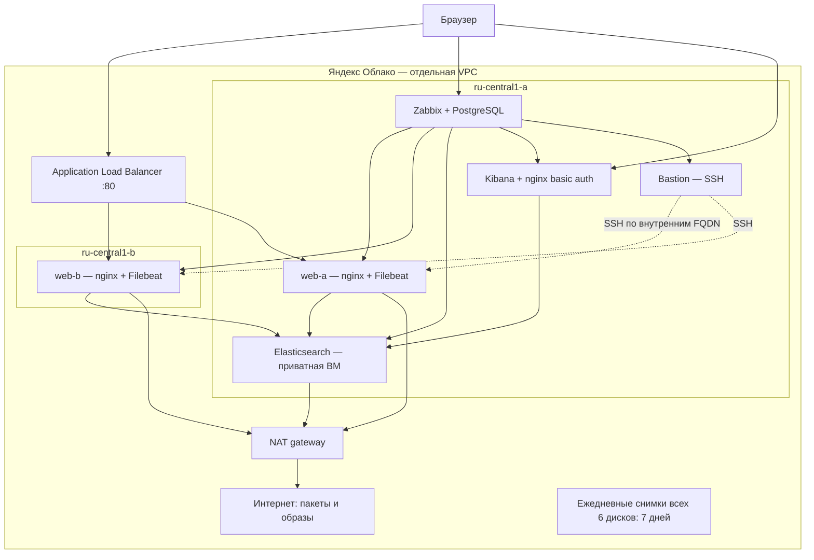
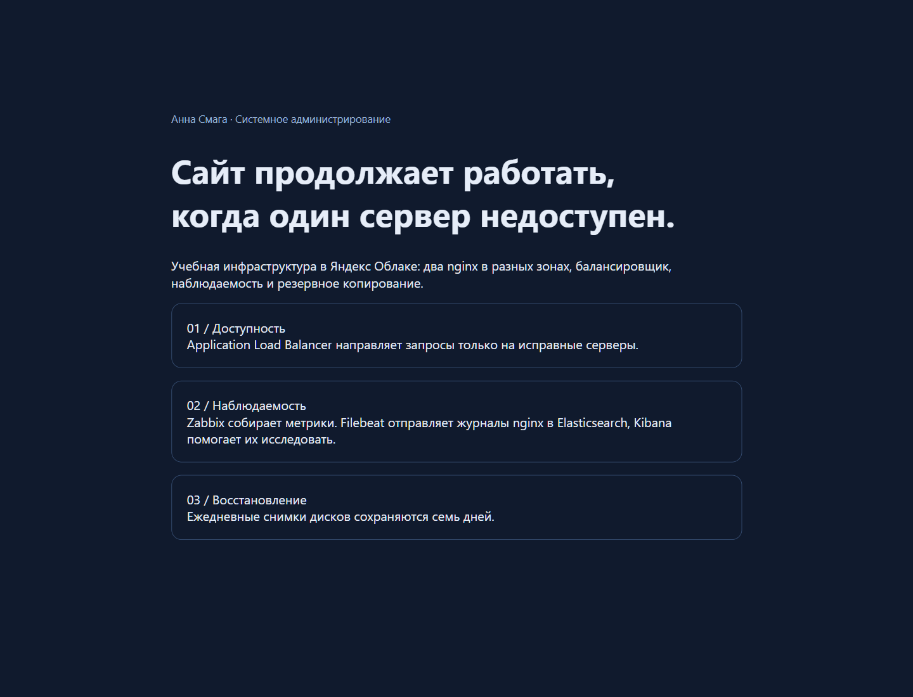
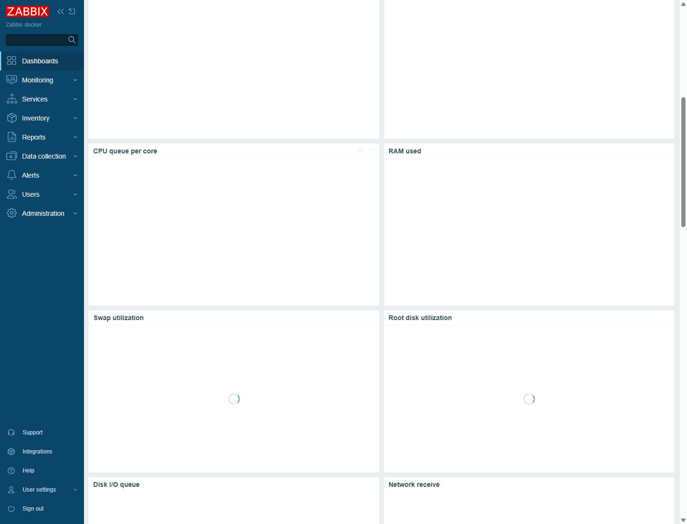
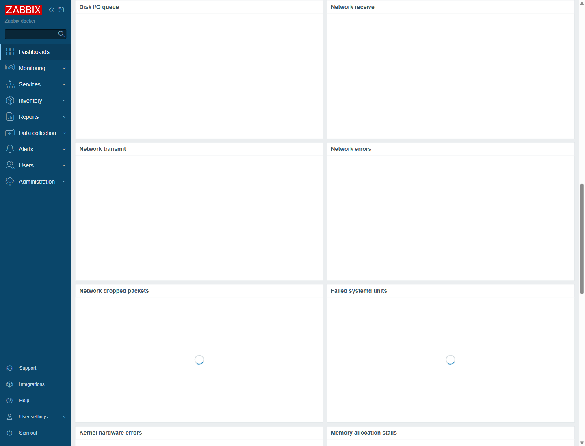
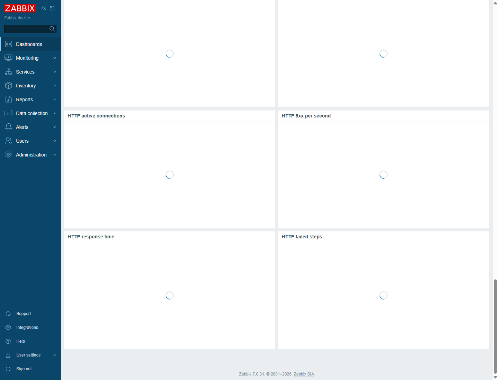
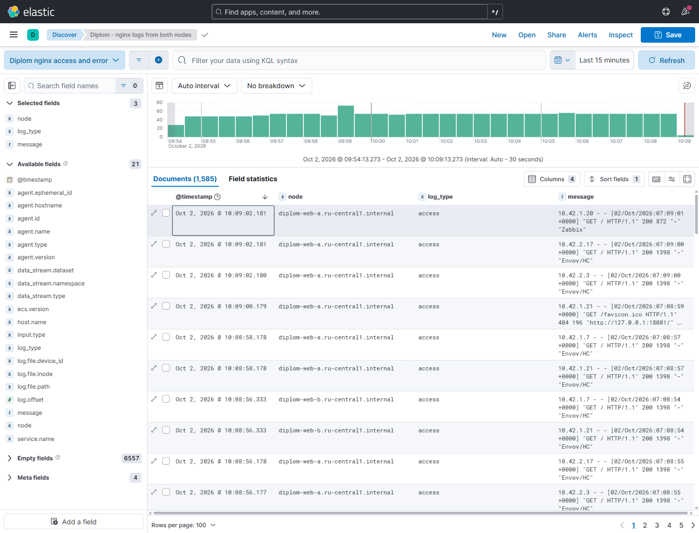

# Дипломная работа: отказоустойчивая инфраструктура в Яндекс Облаке

Анна Смага. Выполнено 2 октября 2026 года по [заданию Netology, ветка diplom-zabbix](https://github.com/netology-code/sys-diplom/tree/diplom-zabbix).

Стенд реально развёрнут через Terraform и Ansible. Два nginx в разных зонах обслуживают одинаковый сайт через Application Load Balancer. Zabbix наблюдает все шесть ВМ, Filebeat отправляет журналы в Elasticsearch, Kibana позволяет их искать. Для всех загрузочных дисков включены ежедневные снимки с хранением семь дней.

## Адреса для проверки

| Сервис | Адрес | Доступ |
|---|---|---|
| Сайт через ALB | http://158.160.166.202 | Без авторизации |
| Zabbix | http://93.77.180.118 | Пользователь `Admin`, пароль передаётся отдельно |
| Kibana | http://93.77.191.206:5601 | Пользователь `reviewer`, пароль передаётся отдельно |

Адреса относятся к действующему стенду; после пересоздания Terraform может выделить другие. Пароли, IAM-токен, SSH-ключи и Terraform state исключены из Git. Учебные HTTP-интерфейсы не шифруют трафик; для обычной эксплуатации требуется домен и TLS. Для административных проверок использован SSH-туннель.

## Архитектура



| ВМ | Зона | Внутренний адрес | RAM | Публичный адрес |
|---|---|---|---|---|
| web-a | a | 10.42.10.10 | 2 ГБ | Нет |
| web-b | b | 10.42.20.10 | 2 ГБ | Нет |
| elastic | a | 10.42.10.20 | 4 ГБ | Нет |
| zabbix | a | 10.42.1.20 | 4 ГБ | 93.77.180.118 |
| kibana | a | 10.42.1.30 | 2 ГБ | 93.77.191.206 |
| bastion | a | 10.42.1.10 | 2 ГБ | 93.77.182.28 |

Каждая ВМ: Ubuntu 24.04, standard-v3, 2 vCPU с гарантированной долей 20%, HDD 10 ГБ, непрерываемая. В inventory используются имена `diplom-<роль>.ru-central1.internal`.

Публичные подсети: `10.42.1.0/24` и `10.42.2.0/24`; приватные: `10.42.10.0/24` и `10.42.20.0/24`. Маршрут приватных подсетей в Интернет проходит через NAT. Внешний SSH разрешён только на бастион и только с административного адреса; остальные ВМ принимают SSH с бастиона. Agent 10050 доступен серверу Zabbix, Elasticsearch 9200 — внутренней сети. ALB принимает HTTP 80 и служебные health checks 30080.

## Соответствие требованиям

| Требование | Реализация и доказательство |
|---|---|
| Terraform и Ansible | [Terraform](terraform/main.tf), [playbook](ansible/site.yml), [inventory](ansible/inventory.ini) |
| Два одинаковых nginx, разные зоны, без внешних IP | Таблица выше, совпадающий SHA-256 в [проверке](evidence/cloud-verification.txt) |
| ALB, target/backend group, router, listener, HTTP health check | Ресурсы Terraform, реальный сайт, проверка отказа ниже |
| Мониторинг всех ВМ | [Состояние и значения элементов](evidence/zabbix-metrics.json), dashboard с шестью страницами |
| USE и пороги | CPU/RAM/диск/сеть, очереди/ошибки, красные линии порогов, triggers; [скрипт](scripts/configure_zabbix.py) |
| HTTP на веб-серверах | Web scenarios `/`, expected 200; RPS, connections, 5xx, response time, failed steps |
| Elasticsearch + Filebeat + Kibana | [Проверка](evidence/cloud-verification.txt): документы обоих узлов, access и error; [saved search](scripts/configure_kibana.py) |
| Снимки ежедневно, хранение 7 дней | Cron `0 2 * * *` UTC, retention 168h, привязаны все 6 дисков; [первый запуск](evidence/snapshots-first-run.json) |
| Сеть, NAT и ограничение входящих соединений | VPC, route table, подсети и отдельные security groups в Terraform |
| Пособие для новичка | [Книга: пять частей](book/README.md), разбор команд, вопросы с ответами и практические упражнения |

## Фактические проверки

1. При работающих nginx ответы HTTP 200 приходили от обоих узлов; backend определяется заголовком `X-Backend`.
2. После остановки nginx на web-a и ожидания 20 секунд все 12 запросов получили HTTP 200 от web-b. После запуска web-a оба backend снова отвечают. Это проверка отказа сервиса nginx, а не моделирование потери целой зоны. [Сценарий проверки](scripts/test_failover.sh).
3. Filebeat принимает журналы обоих узлов. Проверен реальный error log от запроса к запрещённому `/nginx_status`, а не искусственно записанная строка. Счётчики и агрегации приведены в `cloud-verification.txt`.
4. Из готового планового снимка web-b создан дополнительный диск, подключён к web-b и смонтирован `mount -o ro,noload`. SHA-256 файла сайта в снимке и на работающем сервере совпал: `941dd9e74650dc279772573afee45c67eb5e2d079efdeb23b87d6bbc532ae83a`. Временный диск отключён и удалён. Проверка подтверждает восстановление файла, но не заменяет полный тест восстановления PostgreSQL.











Скриншоты получены из настоящих облачных интерфейсов через локальный SSH-туннель. На изображениях нет рабочего стола, строки `C:\Users\...` или паролей. Страницы не подменялись локальными макетами.

## Повторное развёртывание

Подробное объяснение каждой команды находится в книге. Краткая последовательность:

```bash
export YC_TOKEN="$(yc iam create-token)"
cp terraform/terraform.tfvars.example terraform/terraform.tfvars
# Заполнить cloud_id, folder_id, свой публичный SSH-ключ и admin_cidr.
terraform -chdir=terraform init
terraform -chdir=terraform plan
terraform -chdir=terraform apply
terraform -chdir=terraform output
```

Если основной registry недоступен, настройте [официальное зеркало Terraform](https://yandex.cloud/en/docs/tutorials/infrastructure-management/terraform-quickstart). Провайдер закреплён на проверенной версии 0.233.0.

На бастионе установите `ansible-core`, скопируйте каталог проекта без state и локальных секретов. Создайте отдельный ключ развёртывания, добавьте его публичную часть на ВМ и укажите путь в inventory. Использованный путь — `/home/ubuntu/.ssh/diplom`. Затем:

```bash
cp ansible/secrets.example.yml ansible/secrets.yml
# Заменить оба значения на разные случайные пароли.
ansible-playbook -i ansible/inventory.ini ansible/site.yml
python3 scripts/configure_zabbix.py
python3 scripts/configure_kibana.py
python3 scripts/check_metrics.py
bash scripts/check_cloud.sh
```

Вспомогательные `remote.py` и `ui_tunnel.py` — локальные инструменты оператора, использующие уже существующие SSH-настройки компьютера. Они не нужны для стандартного развёртывания через собственный SSH-доступ к бастиону и не содержат учётных данных.

## Ограничения и завершение эксплуатации

Отказоустойчивость относится к веб-слою. Zabbix, Elasticsearch и Kibana представлены одиночными ВМ. Elasticsearch настроен для учебной приватной сети; HTTPS и его собственная авторизация не включены. Снимки дисков с работающими БД являются crash-consistent; для прикладного восстановления дополнительно нужны согласованные дампы и проверка восстановления. Книга объясняет RPO/RTO и разницу между снимком, резервной копией и репликацией.

ВМ, диски, балансировщик и снимки продолжают расходовать облачный бюджет до удаления. После проверки диплома сохраните необходимые доказательства и удалите именно ресурсы этого стенда через `terraform destroy`; существующие ресурсы других домашних работ в state диплома не включены.

## Документация

- [Yandex Cloud: Application Load Balancer](https://yandex.cloud/en/docs/application-load-balancer/).
- [Расписание снимков в Terraform](https://yandex.cloud/en/docs/terraform/resources/compute_snapshot_schedule).
- [Zabbix 7.0: API и мониторинг](https://www.zabbix.com/documentation/7.0/en/manual).
- [Elastic: API data views](https://www.elastic.co/guide/en/kibana/8.15/data-views-api-create.html).
- [USE method, Brendan Gregg](https://www.brendangregg.com/usemethod.html).
