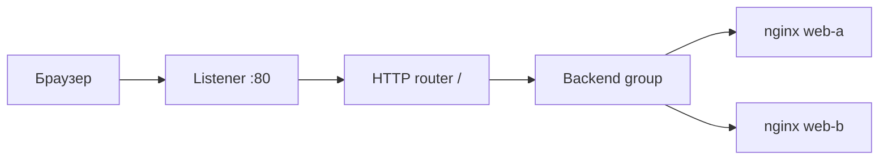

# Часть 3. Сайт и доступность

## 7. Путь одного запроса

Пользователь вводит публичный адрес балансировщика. Браузер устанавливает TCP-соединение с портом 80 и отправляет HTTP-запрос `GET /`. Listener принимает его. HTTP router выбирает маршрут по пути. Virtual host связывает запрос с правилом маршрутизации. Backend group задаёт набор обслуживающих серверов. Target group содержит внутренние адреса двух nginx.

Эти объекты могут выглядеть избыточно для одной страницы, но каждый отвечает за свой уровень. Если позже появится `/api`, его можно направить в другую backend group, сохранив тот же внешний адрес и listener.



Healthcheck выполняется отдельно от пользовательского запроса. В этом проекте он обращается к `/` по HTTP на порт 80. Если подряд получены ошибки, балансировщик временно исключает сервер. Одна неудачная проверка и окончательная потеря сервера — разные события: пороги и интервал позволяют пережить кратковременный сбой.

> **Ключевая мысль.** Балансировщик не исправляет сломанный nginx. Он только направляет запросы на оставшуюся исправную копию.

### Вопросы на защите

**Почему healthcheck именно на `/`?** Это требование задания и минимальная проверка способности nginx отдать страницу. Для приложения проверка должна учитывать его реальные зависимости.

**Почему у двух ВМ одинаковый HTML?** Иначе при переключении пользователь получает разные версии сайта. Разные заголовки `X-Backend` используются только как диагностическая маркировка сервера.

**Гарантируется ли строгое чередование серверов?** Нет. Keep-alive, алгоритм балансировки и состояние backend могут влиять на выбор. Проверяется наличие обоих backend в выборке, а не схема «первый, второй, первый».

## 8. Разбор nginx

```nginx
server {
    listen 80 default_server;
    root /var/www/html;
    add_header X-Backend $hostname always;
    location / { try_files $uri $uri/ =404; }
    location = /nginx_status {
        stub_status;
        allow 127.0.0.1;
        allow 10.42.1.20;
        deny all;
    }
}
```

`listen 80` выбирает порт. `default_server` означает обработчик для запросов, не совпавших с более конкретным виртуальным сервером. `root` задаёт каталог файлов. `try_files` сначала ищет файл, затем каталог; если ни один не подходит, возвращает 404. Код 404 означает «не найдено» и не обязательно означает поломку всего nginx.

`add_header X-Backend $hostname always` добавляет в ответ имя ВМ. Оно помогает доказать, что трафик идёт на оба сервера. Параметр `always` сохраняет заголовок и в ответах с ошибкой. `stub_status` публикует техническую статистику nginx, поэтому доступ ограничен localhost и Zabbix server.

```bash
sudo nginx -t
sudo systemctl reload nginx
sudo systemctl status nginx --no-pager
curl -i http://127.0.0.1/
curl -s http://127.0.0.1/nginx_status
```

`nginx -t` проверяет конфигурацию без её применения. Если он успешен, `reload` перечитывает конфигурацию без обычного полного отключения процесса. `status` показывает состояние systemd-службы; `--no-pager` отключает интерактивный просмотрщик. `curl -i` выводит заголовки и тело. Для просмотра только заголовков можно использовать `curl -I`, но это HTTP HEAD, а не GET.

### Вопросы на защите

**Зачем проверять nginx -t до reload?** Ошибка конфигурации должна быть обнаружена до применения.

**Почему нельзя отдавать nginx_status всем?** Это служебная статистика, необходимая мониторингу, а не посетителю сайта.

**Где ошибка nginx?** Сначала смотрите `systemctl status`, затем `journalctl -u nginx` и `/var/log/nginx/error.log`.

## 9. Как доказать отказоустойчивость

Правильная проверка имеет четыре шага: зафиксировать обычную работу, остановить nginx на одном сервере, проверить ответы балансировщика после исключения backend, вернуть nginx и доказать возвращение второй копии.

```bash
curl -v http://ALB_IP/
for i in $(seq 1 20); do curl -sD - -o /dev/null http://ALB_IP/ | grep -i X-Backend; done
sudo systemctl stop nginx
# На бастионе или клиенте повторить запросы к ALB.
sudo systemctl start nginx
```

Остановку выполняют только на одном web-узле. Первая серия покажет, какие серверы обслуживают сайт. После остановки нужен небольшой промежуток на healthcheck. Во время обнаружения возможны краткие ошибки: не скрывайте их и не обещайте нулевой перерыв без измерений. Итоговое подтверждение — успешные ответы оставшегося backend. После запуска nginx дождитесь двух успешных healthcheck и повторите выборку.

Нельзя назвать проверку выполненной, если вы проверили `curl localhost` на работающей ВМ. Это доказывает работу nginx, но ничего не говорит о маршруте через внешний балансировщик. Также нельзя одновременно остановить оба backend и ожидать доступный сайт.

### Вопросы на защите

**Какой отказ проверен?** Отказ nginx на одной веб-ВМ. Это модель отказа одного backend, но не полная модель катастрофы всей облачной зоны.

**Что остаётся единственной точкой отказа?** Мониторинг и хранилище журналов в минимальной схеме. Для них потребовались бы дополнительные узлы и репликация.

**Как избежать расхождения файлов?** Разворачивать один и тот же `site/index.html` одним playbook на обе машины, затем сравнить `sha256sum`.

## Проверь себя

1. Что делает listener? 2. Где описан маршрут `/`? 3. Что содержит target group? 4. Зачем healthcheck? 5. Что означает 404? 6. Зачем X-Backend? 7. Чем reload отличается от stop/start? 8. Почему localhost недостаточно для проверки ALB? 9. Что сделать после остановки backend? 10. Что не доказывает успешная проверка отказа одного nginx?

<details><summary>Ответы</summary>

1. Принимает внешнее соединение. 2. В HTTP router/virtual host. 3. Адреса web-ВМ и подсети. 4. Исключает неисправный backend. 5. Ресурс не найден. 6. Маркирует обслуживший сервер. 7. Перечитывает конфигурацию без обычного полного остановa. 8. Не проверяется внешний путь. 9. Дождаться healthcheck и проверить ALB, затем восстановить nginx. 10. Полную устойчивость всех сервисов и всего облака.
</details>
